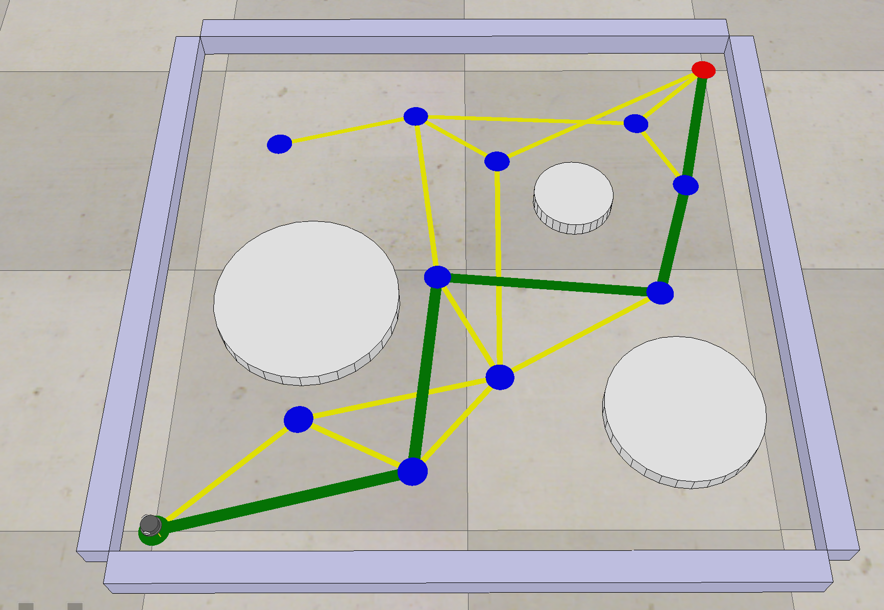
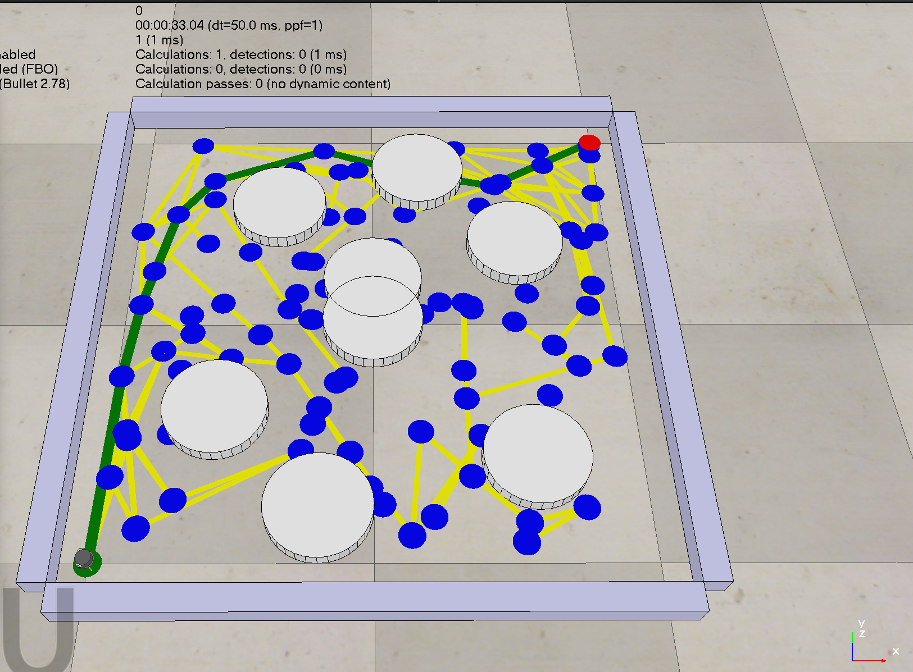
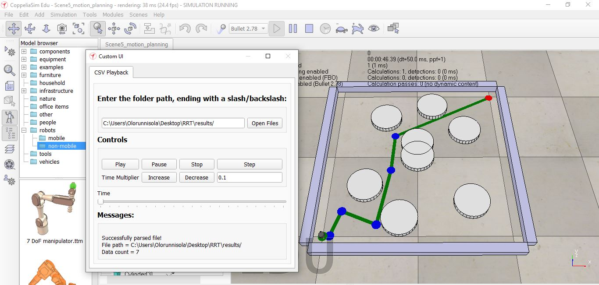

# Path Planning Algorithms for Obstacle Avoidance

This repository contains implementations of various motion planning algorithms for obstacle avoidance, developed as part of the Modern Robotics, Course 4: Robot Motion Planning and Control. The algorithms included are A* Algorithm, Probabilistic Roadmap (PRM), and Rapidly-exploring Random Tree (RRT). These algorithms are fundamental in robotics for navigating an environment while avoiding obstacles.

## Directory Structure

```
Path_planning/
│
├── Astar_algorithm/
│   ├── code_.py
│   ├── results/
│   └── screenshot.png
│
├── PRM/
│   ├── PRM_code.py
│   ├── results/
│   │   ├── edges.csv
│   │   ├── nodes.csv
│   │   ├── obstacles.csv
│   │   └── path.csv
│   └── screenshot.png
│
└── RRT_algorithm/
    ├── code.py
    ├── pseudo.txt
    ├── results/
    │   ├── edges.csv
    │   ├── nodes.csv
    │   ├── obstacles.csv
    │   └── path.csv
    └── Screenshot.JPG
```

## Algorithms

### A* Algorithm

The A* algorithm is a popular and efficient pathfinding algorithm that is used to navigate a graph from a start node to a goal node. It employs a heuristic to estimate the cost of the cheapest path from the current node to the goal.

#### Implementation
- `Astar_algorithm/code_.py`: This script contains the implementation of the A* algorithm.
- `Astar_algorithm/results/`: This directory stores the results of the A* algorithm execution.
- `Astar_algorithm/screenshot.png`: A screenshot showing the results of the A* algorithm.



### Probabilistic Roadmap (PRM)

The Probabilistic Roadmap (PRM) algorithm is used for robot path planning in high-dimensional configuration spaces. It constructs a roadmap of possible paths through randomly sampled points in the space and connects these points using simple paths.

#### Implementation
- `PRM/PRM_code.py`: This script contains the implementation of the PRM algorithm.
- `PRM/results/`: This directory includes:
  - `edges.csv`: The edges of the roadmap.
  - `nodes.csv`: The nodes of the roadmap.
  - `obstacles.csv`: The obstacles in the environment.
  - `path.csv`: The computed path from the start to the goal.
- `PRM/screenshot.png`: A screenshot showing the results of the PRM algorithm.



### Rapidly-exploring Random Tree (RRT)

The Rapidly-exploring Random Tree (RRT) algorithm is an efficient path planning algorithm for high-dimensional spaces. It incrementally builds a tree by randomly sampling the space and extending the nearest node towards the sample.

#### Implementation
- `RRT_algorithm/code.py`: This script contains the implementation of the RRT algorithm.
- `RRT_algorithm/pseudo.txt`: A pseudocode description of the RRT algorithm.
- `RRT_algorithm/results/`: This directory includes:
  - `edges.csv`: The edges of the RRT.
  - `nodes.csv`: The nodes of the RRT.
  - `obstacles.csv`: The obstacles in the environment.
  - `path.csv`: The computed path from the start to the goal.
- `RRT_algorithm/Screenshot.JPG`: A screenshot showing the results of the RRT algorithm.

< imgsrc  />


### Results

The results of each algorithm are stored in their respective `results` directories. You can visualize the output using the provided screenshots.

## Educational Value

These implementations demonstrate key concepts in robot motion planning and control, including heuristic-based search, probabilistic sampling, and tree-based path planning. Understanding these algorithms is essential for developing autonomous navigation systems in robotics.

## Contributing

Contributions are welcome! 
